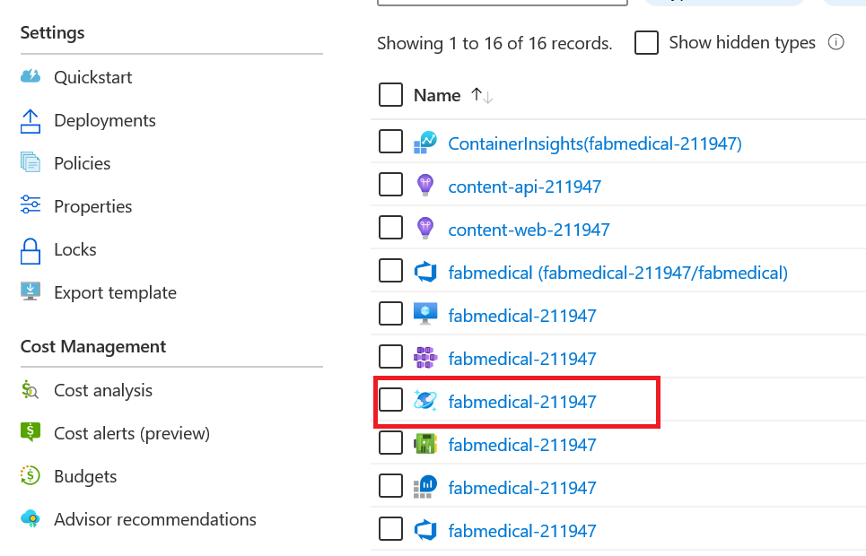
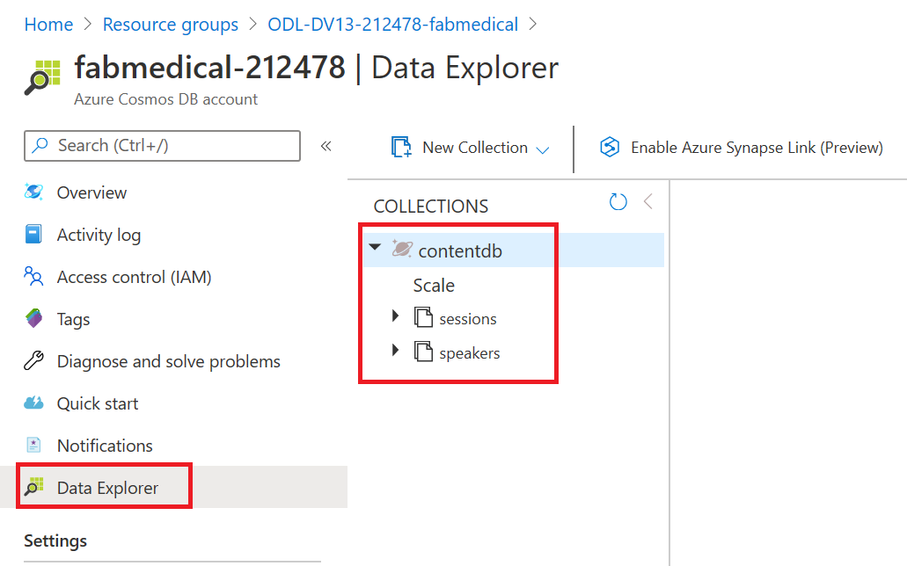
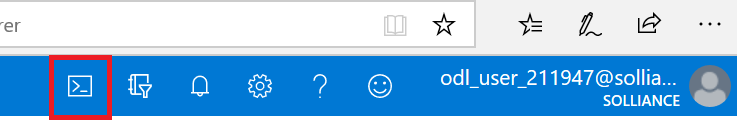
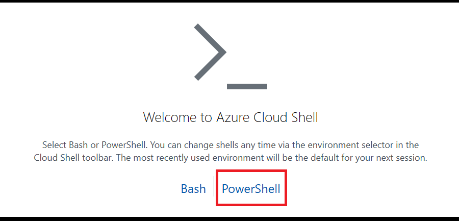
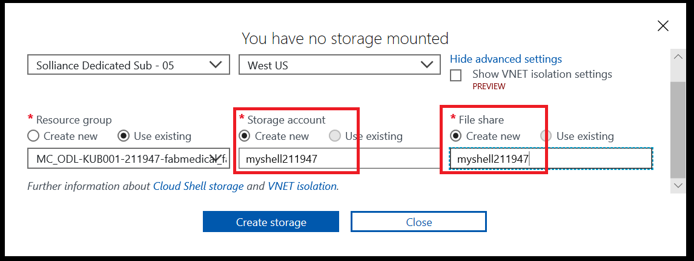

# Day 1 - Lab 1 : Proof of concept deployment

## Exercise 1: Create and run a Docker application

**Duration**: ??? minutes

In this exercise, you will take the starter files and run the ASP.NET Core application to get familiar with the application, and then prepare it for deployment as a Docker application. You will create a Dockerfile, commit this to the repository, and trigger a Docker image build in Azure DevOps. This will generate the DOcker images and push them to the Azure Container Registry.

### Task 1: Review the application

The purpose of this task is to make sure you can run the application successfully before applying changes to run it as a Docker application. This will give you an idea of the application functionality expected when you deploy it to Azure.

   ```text
   TODO: for this task
   update this to use ASP.NET Core application
   change steps to tour the application matching core
   change to remove mongo step, app should be already connected to cosmos
   check all steps, for accuracy, including screenshot updates
   ```

   ```text
   TODO: maybe add this next cosmos check task somewhere?
   ```

1. Open the [Azure Portal](https://portal.azure.com)
2. Login with your lab username and password
3. Close any welcome dialogs
4. Select **Resource Groups**
5. Select the **PREFIX-fabmedical** resource group
6. Select the **fabmedical-SUFFIX** Azure Cosmos DB account

   

7. In the blade menu, select **Data Explorer**, notice it contains two collections.

   

8. Open the Azure Cloud Shell by select the cloud shell icon at the top of the page

   

9. Select `PowerShell`

      

10. Select **Show advanced settings**
11. For the storage account, type **MyShellSUFFIX**
12. For the file share, type **MyShellSUFFIX**
13. Select **Create storage**

      

14. Run the following commands to get the IP address of your build agent

   ```bash
   az vm show -d -g ODL-KUB001-SUFFIX-fabmedical -n fabmedical-SUFFIX --query publicIps -o tsv
   ```

   > **NOTE** If you don't get an IP back, make sure the VM is started.

14. Run the following commands to connect to your build agent, be sure to replace the IP, enter **yes**, then press **ENTER** when prompted about the key fingerprint.  Enter the same password as your lab user.

   ```bash
   ssh adminfabmedical@<IP>
   ```

16. Start the mongo db container image:

   ```bash
   docker network create fabmedical
   docker container run --name mongo --net fabmedical -p 27017:27017 -d mongo
   ```

17. Load the database

   ```bash
   cd content-init
   npm install
   node server.js
   ```

18. Navigate to the content-api directory and run the API.

   ```bash
   cd ../content-api
   npm install
   node server.js
   #dotnet run
   ```

   

12. Test the API using curl. You will request the speaker's content, and this will return a JSON result.

   ```bash
   curl http://localhost:3001/speakers
   ```

   

12. Navigate to the web application directory and run the application.

   ```bash
   cd ../content-web
   node server.js
   #dotnet run
   ```

   

13. From the cloud shell in the build machine edit the app.js file using vim.

   ```bash
   vim app.js
   ```

   Then press **_i_** to get into the edit mode, after that replace localhost with the build machine IP address.

   

   Then press **_ESC_**, write **_:wq_** to save you changes and close the file.

14. Now run the content-web application in the background.

    ```bash
    node app.js &
    #dotnet run
    ```

15. Press **ENTER** again to get a command prompt for the next step.
16. Test the web application using curl. You will see HTML output returned without errors.

    ```bash
    curl http://localhost:3000
    ```

17. If you received a JSON response to the /speakers content request and an HTML response from the web application, your environment is working as expected.

18. Leave the application running in the console, for the next task.
19. Test the web application from a browser. Navigate to the web application using your build agent IP address at port 3000.

   ```text
   http://[BUILDAGENTIP]:3000

   EXAMPLE: http://13.68.113.176:3000
   ```

20. Select the Speakers and Sessions links in the header. You will see the pages display the HTML version of the JSON content you curled previously.

21. Once you have verified the application is accessible through a browser, go to your cloud shell window and stop the running node processes.

   ```bash
   TODO: how to stop the dotnetcore apps???
   killall nodejs
   killall node
   ```

### Task 3: Create a Dockerfile

In this task, you will create a new Dockerfile that will be used to run the API application as a containerized application.

> **Note**: You will be working in a Linux VM without friendly editor tools. You
> must follow the steps very carefully to work with Vim for a few editing
> exercises if you are not already familiar with Vim.

1. From cloud shell, navigate to the content-api folder. List the files in the folder with this command. The output should look like the screenshot below.

   ```bash
   cd ../content-api
   ll
   ```

   

2. Create a new file named "Dockerfile" and note the casing in the name. Use the
   following Vim command to create a new file. The cloud shell window should
   look as shown in the following screenshot.

   ```bash
   vi Dockerfile
   ```

   

3. Select "i" on your keyboard. You will see the bottom of the window showing INSERT mode.

   

4. Type the following into the file. These statements produce a Dockerfile that describes the following:

```
TODO: update all of this with the docker base image for dotnetcore sample
and all the other changes
to do this work, go get the aspnetcore sample in its complete form
```

   - The base stage includes environment setup which we expect to change very rarely, if at all.

     - Creates a new Docker image from the base image node:alpine. This base image has node.js on it and is optimized for small size.

     - Add `curl` to the base image to support Docker health checks.

     - Creates a directory on the image where the application files can be copied.

     - Exposes application port 3001 to the container environment so that the application can be reached at port 3001.

   - The build stage contains all the tools and intermediate files needed to create the application.

     - Creates a new Docker image from node:argon.

     - Creates a directory on the image where the application files can be copied.

     - Copies package.json to the working directory.

     - Runs npm install to initialize the node application environment.

     - Copies the source files for the application over to the image.

   - The final stage combines the base image with the build output from the build stage.

     - Sets the working directory to the application file location.

     - Copies the app files from the build stage.

     - Indicates the command to start the node application when the container is run.

   > **Note**: Type the following into the editor, as you may have errors with copying and pasting:

   ```Dockerfile
   FROM node:alpine AS base
   RUN apk -U add curl
   WORKDIR /usr/src/app
   EXPOSE 3001

   FROM node:argon AS build
   WORKDIR /usr/src/app

   # Install app dependencies
   COPY package.json /usr/src/app/
   RUN npm install

   # Bundle app source
   COPY . /usr/src/app

   FROM base AS final
   WORKDIR /usr/src/app
   COPY --from=build /usr/src/app .
   CMD [ "npm", "start" ]
   ```

5. When you are finished typing, hit the Esc key and type ":wq" and hit the Enter key to save the changes and close the file.

   ```bash
   <Esc>
   :wq
   <Enter>
   ```

6. List the contents of the folder again to verify that the new Dockerfile has been created.

   ```bash
   ll
   ```

   

7. Verify the file contents to ensure it was saved as expected. Type the following command to see the output of the Dockerfile in the command window.

   ```bash
   cat Dockerfile
   ```

### Task 4: Build images and push to Azure Container Registry with a DevOps pipeline

In this task, you will review the YAML definition for the pipeline that builds your Docker image and pushes it to your ACR instance.

1. Login to Azure DevOps to review your build definition. Navigate to the
   `content-api` repository and choose ????.

```
TODO: change this to instructions that find the existing YAML?
we won't run it from here, rather we'll commit changes to run it
```
   

2. Azure DevOps automatically detects the pipeline YAML files (???? EXPLAIN THIS???). 

```
TODO: explain how to find the YAML file
```

FOR EXAMPLE: 

   ```yaml
   name: 0.1.$(Rev:r)

   trigger:
     - master

   resources:
     - repo: self

   variables:
     dockerRegistryServiceConnection: "Fabmedical ACR"
     imageRepository: "content-web"
     containerRegistry: "$(containerRegistryName).azurecr.io"
     containerRegistryName: "fabmedical[SHORT_SUFFIX]"
     dockerfilePath: "$(Build.SourcesDirectory)/Dockerfile"
     tag: "$(Build.BuildNumber)"
     vmImageName: "ubuntu-latest"

   stages:
     - stage: Build
       displayName: Build and Push
       jobs:
         - job: Docker
           displayName: Build and Push Docker Image
           pool:
             vmImage: $(vmImageName)
           steps:
             - checkout: self
               fetchDepth: 1

             - task: Docker@2
               displayName: Build and push an image to container registry
               inputs:
                 command: buildAndPush
                 repository: $(imageRepository)
                 dockerfile: $(dockerfilePath)
                 containerRegistry: $(dockerRegistryServiceConnection)
                 tags: |
                   $(tag)
                   latest
   ```

You can edit those files directly in Azure DevOps as well, and manually run them by selecting `Run` when you are ready to
   execute the pipeline. Select `Run` to run the content-api pipeline. 
   
   

3. Azure DevOps will queue your first build and execute the pipeline when an
   agent becomes available.

   

4. The build should take about five minutes to complete.

   

   > **Note**: The build may fail due to an authorization error related to the
   > Docker Registry Service connection. If this is the case, then select
   > "Authorize Resources" and run the build again.
   > 

5. Setup the `content-web` build. 

   From Azure DevOps, go to the `content-web` repository. This repository already includes `azure-pipelines.yaml`. Choose 'Set up
   Build'.

6. In the "Review your pipeline YAML" step, edit the `containerRegistryName` value to replace `[SHORT_SUFFIX]` with your own three-letter suffix so that it matches your container registry's name.

   

7. When you are finished editing return to the console to commit changes to trigger the build.

TODO: fix this up
Trigger the `content-web` build by commiting the Dockerfile you created in the previous task. 

8. Go to the content web pipeline.... 
```
TODO: update instructions here to add steps that go find the pipeline and watch it execute
```

### Task 5: List images in the Azure Container Registry

In this task you will verify the images are present after the Azure DevOps build pipeline completes. Visit your ACR instance in the Azure portal, you should see new containers tagged with the Azure DevOps build number.

    

1. In the Azure Portal, navigate to your Azure Container Registry (ACR) account, and select Repositories under Services on the left-hand menu. You will now see two, one for each image.

   

2. Select content-api. You will see the `latest` tag is assigned.

   

```
TODO: what do we want to cover re: tagging??
```

## Reference Links

- [TODO](https://www.microsoft.com)
