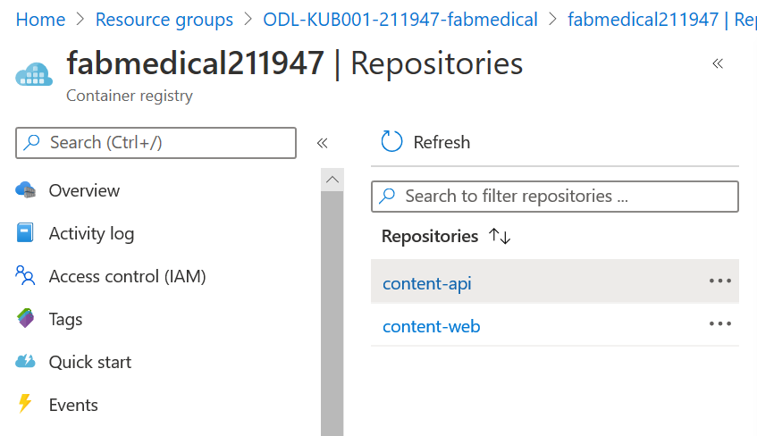
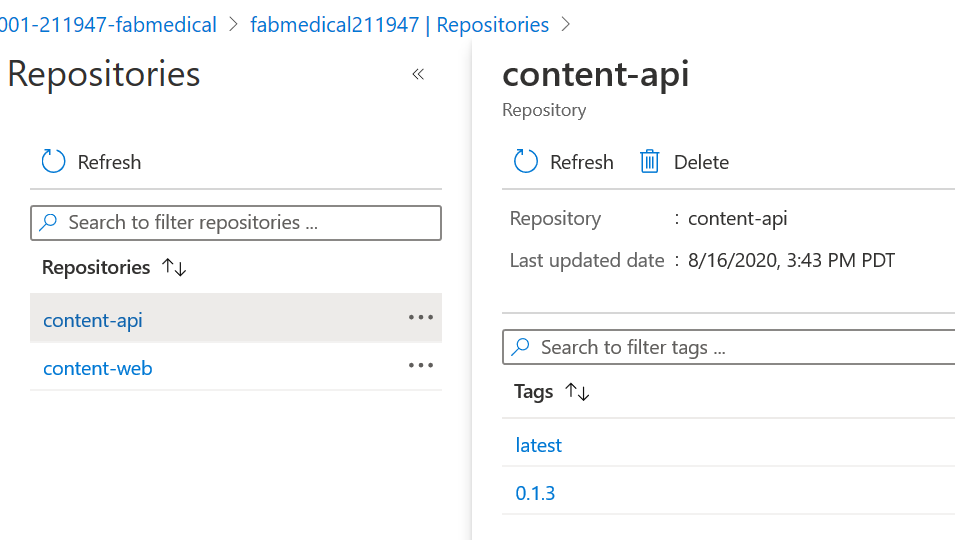
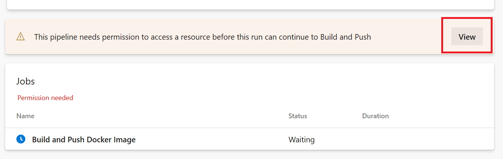

# Day 1 - Lab 1 : Proof of concept deployment

## Exercise 1: Create and run a Docker application

**Duration**: 40 minutes

In this exercise, you will take the starter files and run the node.js application as a Docker application. You will create a Dockerfile, build Docker images, and run containers to execute the application.

### Task 1: Test the application

The purpose of this task is to make sure you can run the application successfully before applying changes to run it as a Docker application.

1. From Azure Cloud Shell, connect to your build agent if you are not already
   connected. (If you need to reconnect, please review the instructions in the
   "Before the HOL" document.)

2. Type the following command to create a Docker network named "fabmedical":

   ```bash
   docker network create fabmedical
   ```

3. Run an instance of mongodb to use for local testing.

   ```bash
   docker container run --name mongo --net fabmedical -p 27017:27017 -d mongo
   ```

4. Confirm that the mongo container is running and ready.

   ```bash
   docker container list
   docker container logs mongo
   ```

   

5. Connect to the mongo instance using the mongo shell and test some basic commands:

   ```bash
   mongo
   ```

   ```text
   show dbs
   quit()
   ```

   

6. To initialize the local database with test content, first navigate to the content-init directory and run npm install.

   ```bash
   cd content-init
   npm install
   ```

   > **Note**: In some cases, the `root` user will be assigned ownership of your user's `.config` folder. If this happens, run the following command to return ownership to `adminfabmedical` and then try `npm install` again:

   ```bash
   sudo chown -R $USER:$(id -gn $USER) /home/adminfabmedical/.config
   ```

7. Initialize the database.

   ```bash
   nodejs server.js
   ```

   

8. Confirm that the database now contains test data.

   ```bash
   mongo
   ```

   ```text
   show dbs
   use contentdb
   show collections
   db.speakers.find()
   db.sessions.find()
   quit()
   ```

   This should produce output similar to the following:

   

9. Now navigate to the content-api directory and run npm install.

   ```bash
   cd ../content-api
   npm install
   ```

   > **Note**: In some cases, the `root` user will be assigned ownership of your user's `.config` folder. If this happens, run the following command to return ownership to `adminfabmedical` and then try `npm install` again:

   ```bash
   sudo chown -R $USER:$(id -gn $USER) /home/adminfabmedical/.config
   ```

10. Start the API as a background process.

    ```bash
    nodejs ./server.js &
    ```

    

11. Press ENTER again to get to a command prompt for the next step.

12. Test the API using curl. You will request the speaker's content, and this will return a JSON result.

    ```bash
    curl http://localhost:3001/speakers
    ```

    

13. Navigate to the web application directory, run npm install and ng build.

    ```bash
    cd ../content-web
    npm install
    ng build
    ```

    

    > **Note**: In some cases, the `root` user will be assigned ownership of your user's `.config` folder. If this happens, run the following command to return ownership to `adminfabmedical` and then try `npm install` again:

    ```bash
    sudo chown -R $USER:$(id -gn $USER) /home/adminfabmedical/.config
    ```

14. From Azure cloud shell, run the following command to find the IP address for the build agent VM provisioned when you ran the ARM deployment.

    ```bash
    az vm show -d -g fabmedical-[SUFFIX] -n fabmedical-[SHORT_SUFFIX] --query publicIps -o tsv
    ```

    Example:

    ```bash
    az vm show -d -g fabmedical-sol -n fabmedical-SOL --query publicIps -o tsv
    ```

15. From the cloud shell in the build machine edit the app.js file using vim.

    ```bash
    vim app.js
    ```

    Then press **_i_** to get into the edit mode, after that replace localhost with the build machine IP address.

    

    Then press **_ESC_**, write **_:wq_** to save you changes and close the file.

16. Now run the content-web application in the background.

    ```bash
    node ./app.js &
    ```

    Press ENTER again to get a command prompt for the next step.

17. Test the web application using curl. You will see HTML output returned without errors.

    ```bash
    curl http://localhost:3000
    ```

18. Leave the application running for the next task.

19. If you received a JSON response to the /speakers content request and an HTML response from the web application, your environment is working as expected.

### Task 2: Browsing to the web application

In this task, you will browse to the web application for testing.

1. From the Azure portal select the resource group you created named fabmedical-SUFFIX.

2. Select the build agent VM named fabmedical-SUFFIX from your list of available resources.

   

3. From the Virtual Machine blade overview, find the IP address of the VM.

   

4. Test the web application from a browser. Navigate to the web application using your build agent IP address at port 3000.

   ```text
   http://[BUILDAGENTIP]:3000

   EXAMPLE: http://13.68.113.176:3000
   ```

5. Select the Speakers and Sessions links in the header. You will see the pages display the HTML version of the JSON content you curled previously.

6. Once you have verified the application is accessible through a browser, go to your cloud shell window and stop the running node processes.

   ```bash
   killall nodejs
   killall node
   ```

### Task 3: Create a Dockerfile

In this task, you will create a new Dockerfile that will be used to run the API application as a containerized application.

> **Note**: You will be working in a Linux VM without friendly editor tools. You
> must follow the steps very carefully to work with Vim for a few editing
> exercises if you are not already familiar with Vim.

1. From cloud shell, navigate to the content-api folder. List the files in the folder with this command. The output should look like the screenshot below.

   ```bash
   cd ../content-api
   ll
   ```

   

2. Create a new file named "Dockerfile" and note the casing in the name. Use the
   following Vim command to create a new file. The cloud shell window should
   look as shown in the following screenshot.

   ```bash
   vi Dockerfile
   ```

   

3. Select "i" on your keyboard. You will see the bottom of the window showing INSERT mode.

   

4. Type the following into the file. These statements produce a Dockerfile that describes the following:

   - The base stage includes environment setup which we expect to change very rarely, if at all.

     - Creates a new Docker image from the base image node:alpine. This base image has node.js on it and is optimized for small size.

     - Add `curl` to the base image to support Docker health checks.

     - Creates a directory on the image where the application files can be copied.

     - Exposes application port 3001 to the container environment so that the application can be reached at port 3001.

   - The build stage contains all the tools and intermediate files needed to create the application.

     - Creates a new Docker image from node:argon.

     - Creates a directory on the image where the application files can be copied.

     - Copies package.json to the working directory.

     - Runs npm install to initialize the node application environment.

     - Copies the source files for the application over to the image.

   - The final stage combines the base image with the build output from the build stage.

     - Sets the working directory to the application file location.

     - Copies the app files from the build stage.

     - Indicates the command to start the node application when the container is run.

   > **Note**: Type the following into the editor, as you may have errors with copying and pasting:

   ```Dockerfile
   FROM node:alpine AS base
   RUN apk -U add curl
   WORKDIR /usr/src/app
   EXPOSE 3001

   FROM node:argon AS build
   WORKDIR /usr/src/app

   # Install app dependencies
   COPY package.json /usr/src/app/
   RUN npm install

   # Bundle app source
   COPY . /usr/src/app

   FROM base AS final
   WORKDIR /usr/src/app
   COPY --from=build /usr/src/app .
   CMD [ "npm", "start" ]
   ```

5. When you are finished typing, hit the Esc key and type ":wq" and hit the Enter key to save the changes and close the file.

   ```bash
   <Esc>
   :wq
   <Enter>
   ```

6. List the contents of the folder again to verify that the new Dockerfile has been created.

   ```bash
   ll
   ```

   

7. Verify the file contents to ensure it was saved as expected. Type the following command to see the output of the Dockerfile in the command window.

   ```bash
   cat Dockerfile
   ```

### Task 4: Create Docker images

In this task, you will create Docker images for the application --- one for the API application and another for the web application. Each image will be created via Docker commands that rely on a Dockerfile.

1. From cloud shell connected to the build agent VM, type the following command
   to view any Docker images on the VM. The list will only contain the mongodb
   image downloaded earlier.

   ```bash
   docker image ls
   ```

2. From the content-api folder containing the API application files and the new Dockerfile you created, type the following command to create a Docker image for the API application. This command does the following:

   - Executes the Docker build command to produce the image

   - Tags the resulting image with the name content-api (-t)

   - The final dot (".") indicates to use the Dockerfile in this current directory context. By default, this file is expected to have the name "Dockerfile" (case sensitive).

   ```bash
   docker image build -t content-api .
   ```

3. Once the image is successfully built, run the Docker images listing command again. You will see several new images: the node images and your container image.

   ```bash
   docker image ls
   ```

   Notice the untagged image. This is the build stage which contains all the intermediate files not needed in your final image.

   

4. Commit and push the new Dockerfile before continuing.

   ```bash
   git add .
   git commit -m "Added Dockerfile"
   git push
   ```

   Enter credentials if prompted.

5. Navigate to the content-web folder again and list the files. Note that this folder already has a Dockerfile.

   ```bash
   cd ../content-web
   ll
   ```

6. View the Dockerfile contents -- which are similar to the file you created previously in the API folder. Type the following command:

   ```bash
   cat Dockerfile
   ```

   Notice that the content-web Dockerfile build stage includes additional tools for a front-end Angular application in addition to installing npm packages.

7. Type the following command to create a Docker image for the web application.

   ```bash
   docker image build -t content-web .
   ```

8. When complete, you will see seven images now exist when you run the Docker images command.

   ```bash
   docker image ls
   ```

   

### Task 5: Run a containerized application

The web application container will be calling endpoints exposed by the API application container and the API application container will be communicating with mongodb. In this exercise, you will launch the images you created as containers on the same bridge network you created when starting mongodb.

1. Create and start the API application container with the following command. The command does the following:

   - Names the container "api" for later reference with Docker commands.

   - Instructs the Docker engine to use the "fabmedical" network.

   - Instructs the Docker engine to use port 3001 and map that to the internal container port 3001.

   - Creates a container from the specified image, by its tag, such as content-api.

   ```bash
   docker container run --name api --net fabmedical -p 3001:3001 content-api
   ```

2. The `docker container run` command has failed because it is configured to connect to mongodb using a localhost URL. However, now that content-api is isolated in a separate container, it cannot access mongodb via localhost even when running on the same docker host. Instead, the API must use the bridge network to connect to mongodb.

   ```text
   > content-api@0.0.0 start /usr/src/app
   > node ./server.js

   Listening on port 3001
   Could not connect to MongoDB!
   MongoTimeoutError: Server selection timed out after 30000 ms
   npm ERR! code ELIFECYCLE
   npm ERR! errno 255
   npm ERR! content-api@0.0.0 start: `node ./server.js`
   npm ERR! Exit status 255
   npm ERR!
   npm ERR! Failed at the content-api@0.0.0 start script.
   npm ERR! This is probably not a problem with npm. There is likely additional logging output above.

   npm ERR! A complete log of this run can be found in:
   npm ERR!     /root/.npm/_logs/2019-12-04T22_39_38_815Z-debug.log
   ```

3. The content-api application allows an environment variable to configure the mongodb connection string. Remove the existing container, and then instruct the docker engine to set the environment variable by adding the `-e` switch to the `docker container run` command. Also, use the `-d` switch to run the api as a daemon.

   ```bash
   docker container rm api
   docker container run --name api --net fabmedical -p 3001:3001 -e MONGODB_CONNECTION=mongodb://mongo:27017/contentdb -d content-api
   ```

4. Enter the command to show running containers. You will observe that the "api" container is in the list. Use the docker logs command to see that the API application has connected to mongodb.

   ```bash
   docker container ls
   docker container logs api
   ```

   

5. Test the API by curling the URL. You will see JSON output as you did when testing previously.

   ```bash
   curl http://localhost:3001/speakers
   ```

6. Create and start the web application container with a similar `docker container run` command -- instruct the docker engine to use any port with the `-P` command.

   ```bash
   docker container run --name web --net fabmedical -P -d content-web
   ```

7. Enter the command to show running containers again, and you will observe that both the API and web containers are in the list. The web container shows a dynamically assigned port mapping to its internal container port 3000.

   ```bash
   docker container ls
   ```

   

8. Test the web application by fetching the URL with curl. For the port, use the dynamically assigned port, which you can find in the output from the previous command. You will see HTML output, as you did when testing previously.

   ```bash
   curl http://localhost:[PORT]/speakers.html
   ```

### Task 6: Setup environment variables

In this task, you will configure the "web" container to communicate with the API container using an environment variable, similar to the way the mongodb connection string is provided to the api.

1. From cloud shell connected to the build agent VM, stop and remove the web container using the following commands.

   ```bash
   docker container stop web
   docker container rm web
   ```

2. Validate that the web container is no longer running or present by using the -a flag as shown in this command. You will see that the "web" container is no longer listed.

   ```bash
   docker container ls -a
   ```

3. Review the `app.js` file.

   ```bash
   cat app.js
   ```

4. Observe that the contentApiUrl variable can be set with an environment variable.

   ```javascript
   const contentApiUrl = process.env.CONTENT_API_URL || "http://localhost:3001";
   ```

5. Open the Dockerfile for editing using Vim and press the "i" key to go into edit mode.

   ```bash
   vi Dockerfile
   <i>
   ```

6. Locate the EXPOSE line shown below and add a line above it that sets the default value for the environment variable, as shown in the screenshot.

   ```Dockerfile
   ENV CONTENT_API_URL http://localhost:3001
   ```

   

7. Press the Escape key and type ":wq" and then press the Enter key to save and close the file.

   ```text
   <Esc>
   :wq
   <Enter>
   ```

8. Rebuild the web application Docker image using the same command as you did previously.

   ```bash
   docker image build -t content-web .
   ```

9. Create and start the image passing the correct URI to the API container as an environment variable. This variable will address the API application using its container name over the Docker network you created. After running the container, check to see the container is running and note the dynamic port assignment for the next step.

   ```bash
   docker container run --name web --net fabmedical -P -d -e CONTENT_API_URL=http://api:3001 content-web
   docker container ls
   ```

10. Curl the speakers path again, using the port assigned to the web container. Again, you will see HTML returned, but because curl does not process javascript, you cannot determine if the web application is communicating with the api application. You must verify this connection in a browser.

    ```bash
    curl http://localhost:[PORT]/speakers.html
    ```

11. You will not be able to browse to the web application on the ephemeral port because the VM only exposes a limited port range. Now you will stop the web container and restart it using port 3000 to test in the browser. Type the following commands to stop the container, remove it, and run it again using explicit settings for the port.

    ```bash
    docker container stop web
    docker container rm web
    docker container run --name web --net fabmedical -p 3000:3000 -d -e CONTENT_API_URL=http://api:3001 content-web
    ```

12. Curl the speaker path again, using port 3000. You will see the same HTML returned.

    ```bash
    curl http://localhost:3000/speakers.html
    ```

13. You can now use a web browser to navigate to the website and successfully view the application at port 3000. Replace [BUILDAGENTIP] with the IP address you used previously.

    ```bash
    http://[BUILDAGENTIP]:3000

    EXAMPLE: http://13.68.113.176:3000
    ```

14. Commit your changes and push to the repository.

    ```bash
    git add .
    git commit -m "Setup Environment Variables"
    git push
    ```

    Enter credentials if prompted.

### Task 7: Run several containers with Docker compose

Managing several containers with all their command line options can become
difficult as the solution grows. `docker-compose` allows us to declare options
for several containers and run them together.

1. First, cleanup the existing containers.

   ```bash
   docker container stop web && docker container rm web
   docker container stop api && docker container rm api
   docker container stop mongo && docker container rm mongo
   ```

2. Navigate to your home directory (where you checked out the content repositories) and create a docker compose file.

   ```bash
   cd ~
   vi docker-compose.yml
   <i>
   ```

   Type the following as the contents of `docker-compose.yml`:

   ```yaml
   version: "3.4"

   services:
     mongo:
       image: mongo
       restart: always

     api:
       build: ./content-api
       image: content-api
       depends_on:
         - mongo
       environment:
         MONGODB_CONNECTION: mongodb://mongo:27017/contentdb

     web:
       build: ./content-web
       image: content-web
       depends_on:
         - api
       environment:
         CONTENT_API_URL: http://api:3001
       ports:
         - "3000:3000"
   ```

   Press the Escape key and type ":wq" and then press the Enter key to save and close the file.

   ```text
   <Esc>
   :wq
   <Enter>
   ```

3. Start the applications with the `up` command.

   ```bash
   docker-compose -f docker-compose.yml -p fabmedical up -d
   ```

   

4. Visit the website in the browser; notice that we no longer have any data on the speakers or sessions pages.

   

5. We stopped and removed our previous mongodb container; all the data contained in it has been removed. Docker compose has created a new, empty mongodb instance that must be reinitialized. If we care to persist our data between container instances, docker has several mechanisms to do so. First, we will update our compose file to persist mongodb data to a directory on the build agent.

   ```bash
   mkdir data
   vi docker-compose.yml
   ```

   Update the mongo service to mount the local data directory onto to the `/data/db` volume in the docker container.

   ```yaml
   mongo:
     image: mongo
     restart: always
     volumes:
       - ./data:/data/db
   ```

   The result should look similar to the following screenshot:

   

6. Next, we will add a second file to our composition so that we can initialize the mongodb data when needed.

   ```bash
   vi docker-compose.init.yml
   ```

   Add the following as the content:

   ```yaml
   version: "3.4"

   services:
     init:
       build: ./content-init
       image: content-init
       depends_on:
         - mongo
       environment:
         MONGODB_CONNECTION: mongodb://mongo:27017/contentdb
   ```

7. To reconfigure the mongodb volume, we need to bring down the mongodb service first.

   ```bash
   docker-compose -f docker-compose.yml -p fabmedical down
   ```

   

8. Now run `up` again with both files to update the mongodb configuration and run the initialization script.

   ```bash
   docker-compose -f docker-compose.yml -f docker-compose.init.yml -p fabmedical up -d
   ```

9. Check the data folder to see that mongodb is now writing data files to the host.

   ```bash
   ls ./data/
   ```

   

10. Check the results in the browser. The speaker and session data are now available.

    

### Task 8: Push images to Azure Container Registry

To run containers in a remote environment, you will typically push images to a Docker registry, where you can store and distribute images. Each service will have a repository that can be pushed to and pulled from with Docker commands. Azure Container Registry (ACR) is a managed private Docker registry service based on Docker Registry v2.

In this task, you will push images to your ACR account, version images with tagging, and setup continuous integration (CI) to build future versions of your containers and push them to ACR automatically.

1. In the [Azure Portal](https://portal.azure.com/), navigate to the ACR you created in Before the hands-on lab.

2. Select Access keys under Settings on the left-hand menu.

   

3. The Access keys blade displays the Login server, username, and password that will be required for the next step. Keep this handy as you perform actions on the build VM.

   > **Note**: If the username and password do not appear, select Enable on the Admin user option.

4. From the cloud shell session connected to your build VM, login to your ACR account by typing the following command. Follow the instructions to complete the login.

   ```bash
   docker login [LOGINSERVER] -u [USERNAME] -p [PASSWORD]
   ```

   For example:

   ```bash
   docker login fabmedicalsoll.azurecr.io -u fabmedicalsoll -p +W/j=l+Fcze=n07SchxvGSlvsLRh/7ga
   ```

   

   **Tip: Make sure to specify the fully qualified registry login server (all lowercase).**

5. Run the following commands to properly tag your images to match your ACR account name.

   ```bash
   docker image tag content-web [LOGINSERVER]/content-web
   docker image tag content-api [LOGINSERVER]/content-api
   ```

6. List your docker images and look at the repository and tag. Note that the repository is prefixed with your ACR login server name, such as the sample shown in the screenshot below.

   ```bash
   docker image ls
   ```

   

7. Push the images to your ACR account with the following command:

   ```bash
   docker image push [LOGINSERVER]/content-web
   docker image push [LOGINSERVER]/content-api
   ```

   ![In this screenshot of the console window, an example of images being pushed to an ACR account results from typing and running the following at the command prompt: docker push [LOGINSERVER]/content-web.](media/image67.png)

8. In the Azure Portal, navigate to your ACR account, and select Repositories under Services on the left-hand menu. You will now see two, one for each image.

   

9. Select content-api. You will see the latest tag is assigned.

   

10. From the cloud shell session attached to the VM, assign the v1 tag to each image with the following commands. Then list the Docker images to note that there are now two entries for each image: showing the latest tag and the v1 tag. Also note that the image ID is the same for the two entries, as there is only one copy of the image.

    ```bash
    docker image tag [LOGINSERVER]/content-web:latest [LOGINSERVER]/content-web:v1
    docker image tag [LOGINSERVER]/content-api:latest [LOGINSERVER]/content-api:v1
    docker image ls
    ```

    

11. Repeat Step 7 to push the images to ACR again so that the newly tagged v1 images are pushed. Then refresh one of the repositories to see the two versions of the image now appear.

    

12. Run the following commands to pull an image from the repository. Note that the default behavior is to pull images tagged with "latest." You can pull a specific version using the version tag. Also, note that since the images already exist on the build agent, nothing is downloaded.

    ```bash
    docker image pull [LOGINSERVER]/content-web
    docker image pull [LOGINSERVER]/content-web:v1
    ```

### Task 9: Setup CI Pipeline to Push Images

In this task, you will use YAML to define a pipeline that builds your Docker
image and pushes it to your ACR instance automatically.

1. In your cloud shell session connected to the build agent VM, navigate to the
   `content-web` directory:

   ```bash
   cd ~/content-web
   ```

2. Next create the pipeline YAML file.

   ```bash
   vi azure-pipelines.yml
   ```

   Add the following as the content (replacing SHORT_SUFFIX with your short
   suffix such as SOL):

   ```yaml
   name: 0.1.$(Rev:r)

   trigger:
     - master

   resources:
     - repo: self

   variables:
     dockerRegistryServiceConnection: "Fabmedical ACR"
     imageRepository: "content-web"
     containerRegistry: "$(containerRegistryName).azurecr.io"
     containerRegistryName: "fabmedical[SHORT_SUFFIX]"
     dockerfilePath: "$(Build.SourcesDirectory)/Dockerfile"
     tag: "$(Build.BuildNumber)"
     vmImageName: "ubuntu-latest"

   stages:
     - stage: Build
       displayName: Build and Push
       jobs:
         - job: Docker
           displayName: Build and Push Docker Image
           pool:
             vmImage: $(vmImageName)
           steps:
             - checkout: self
               fetchDepth: 1

             - task: Docker@2
               displayName: Build and push an image to container registry
               inputs:
                 command: buildAndPush
                 repository: $(imageRepository)
                 dockerfile: $(dockerfilePath)
                 containerRegistry: $(dockerRegistryServiceConnection)
                 tags: |
                   $(tag)
                   latest
   ```

3. Save the pipeline YAML, then commit and push it to the Azure DevOps
   repository:

   ```bash
   git add azure-pipelines.yml
   git commit -m "Added pipeline YAML"
   git push
   ```

4. Now login to Azure DevOps to create your first build. Navigate to the
   `content-web` repository and choose 'Set up Build'.

   

5. Azure DevOps will automatically detect the pipeline YAML you added. You can
   make additional edits here if needed. Select `Run` when you are ready to
   execute the pipeline.

   

6. Azure DevOps will queue your first build and execute the pipeline when an
   agent becomes available.

   

7. The build should take about five minutes to complete.

   

   > **Note**: The build may fail due to an authorization error related to the
   > Docker Registry Service connection. If this is the case, then select
   > "Authorize Resources" and run the build again.
   > 

8. Next, create the `content-api` build. Select the `content-api` repository.
   This repository already includes `azure-pipelines.yaml`. Choose 'Set up
   Build'.

9. In the "Review your pipeline YAML" step, edit the `containerRegistryName` value to replace `[SHORT_SUFFIX]` with your own three-letter suffix so that it matches your container registry's name.

   

10. When you are finished editing, select `Run` to execute the pipeline.

11. While the `content-api` build runs, setup one last build for `content-init` by following the same steps as the previous `content-api` build, remembering to update the `[SHORT_SUFFIX]` value on the "Review your pipeline YAML" step.

12. Visit your ACR instance in the Azure portal, you should see new containers
    tagged with the Azure DevOps build number.

    

## Reference Links

- [TODO](https://www.microsoft.com)
