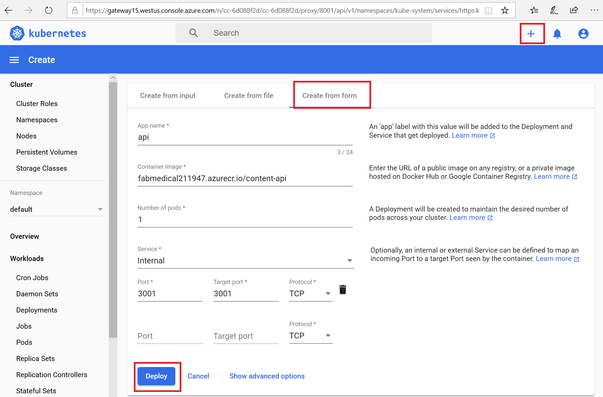

# Day 1 - Lab 2 : Deploy the solution to Azure Kubernetes Service

Workshop Template

## Exercise 1: Deploy containerized applications to Azure Kubernetes Service

**Duration**: ??? minutes

In this exercise, you will connect to the Azure Kubernetes Service cluster you created before the hands-on lab and deploy the Docker containers from the Azure Container Registry to the Kubernetes cluster.

### Task 1: Tunnel into the Azure Kubernetes Service cluster

In this task, you will gather the information you need about your Azure Kubernetes Service cluster to connect to the cluster and execute commands to connect to the Kubernetes management dashboard from cloud shell.

1. Open a **new** Azure Cloud Shell console by opening a window to https://shell.azure.com.

2. Configure kubectl to connect to the Kubernetes cluster by running the following commands:

    ```bash
    az aks get-credentials --name fabmedical-SUFFIX --resource-group ODL-KUB001-SUFFIX-fabmedical
    ```

3. Test that the configuration is correct by running a simple kubectl command to produce a list of nodes:

    ```bash
    kubectl get nodes
    ```

    

4. Setup access for the dashboard

    ```bash
    kubectl create clusterrolebinding kubernetes-dashboard --clusterrole=cluster-admin --serviceaccount=kube-system:kubernetes-dashboard --user=clusterUser
    ```

5. Get your user access token by running the following, save it for the next step.

    ```bash
    kubectl config view -o jsonpath='{.users[0].user.token}'
    ```

6. Create an SSH tunnel linking a local port (8001) on your cloud shell host to port 443 on the management node of the cluster. Cloud shell will then use the web preview feature to give you remote access to the Kubernetes dashboard. Execute the command below replacing the values as follows:

   > **Note**: After you run this command, it may work at first and later lose its connection, so you may have to run this again to reestablish the connection. If the Kubernetes dashboard becomes unresponsive in the browser this is an indication to return here and check your tunnel or rerun the command.

   ```bash
   az aks browse --name fabmedical-SUFFIX --resource-group fabmedical-SUFFIX
   ```

   

7. In the Kubernetes Dashboard, select **Token** and then copy your user token

8. Select **Sign in**. If the tunnel is successful, you will see the Kubernetes management dashboard.

    

    > **NOTE** You may need to download the `.kube\config` file from the cloud shell and use that for your authentication via kubeconfig.

### Task 2: Deploy a service using kubectl

In this task, deploy the web service using `kubectl` and the api service using the dashboard.

1. Open a **new** Azure Cloud Shell console by opening a window to https://shell.azure.com.

2. Create a text file called api.deployment.yml using the Azure Cloud Shell
   Editor.

   ```bash
   code web.deployment.yml
   ```

3. Copy and paste the following text into the editor:

   > **Note**: Be sure to copy and paste only the contents of the code block carefully to avoid introducing any special characters.

   ```yaml
   apiVersion: apps/v1
   kind: Deployment
   metadata:
     labels:
         app: web
     name: web
   spec:
     replicas: 1
     selector:
         matchLabels:
           app: web
     strategy:
         rollingUpdate:
           maxSurge: 1
           maxUnavailable: 1
         type: RollingUpdate
     template:
         metadata:
           labels:
               app: web
           name: web
         spec:
           containers:
           - image: [LOGINSERVER].azurecr.io/content-web
             env:
               - name: CONTENT_API_URL
                 value: http://api:3001
             livenessProbe:
               httpGet:
                   path: /
                   port: 3000
               initialDelaySeconds: 30
               periodSeconds: 20
               timeoutSeconds: 10
               failureThreshold: 3
             imagePullPolicy: Always
             name: web
             ports:
               - containerPort: 3000
                 hostPort: 80
                 protocol: TCP
             resources:
               requests:
                   cpu: 1000m
                   memory: 128Mi
             securityContext:
               privileged: false
             terminationMessagePath: /dev/termination-log
             terminationMessagePolicy: File
           dnsPolicy: ClusterFirst
           restartPolicy: Always
           schedulerName: default-scheduler
           securityContext: {}
           terminationGracePeriodSeconds: 30
   ```

4. Update the [LOGINSERVER] entry to match the name of your ACR login server.

5. Select the **...** button and choose **Save**.

   

6. Select the **...** button again and choose **Close Editor**.

   

7. Create a text file called web.service.yml using the Azure Cloud Shell
   Editor.

   ```bash
   code web.service.yml
   ```

8. Copy and paste the following text into the editor:

   > **Note**: Be sure to copy and paste only the contents of the code block carefully to avoid introducing any special characters.

   ```yaml
   apiVersion: v1
   kind: Service
   metadata:
     labels:
       app: web
     name: web
   spec:
     ports:
       - name: web-traffic
         port: 80
         protocol: TCP
         targetPort: 3000
     selector:
       app: web
     sessionAffinity: None
     type: LoadBalancer
   ```

9. Save changes and close the editor.

10. Type the following command to deploy the application described by the YAML
    files. You will receive a message indicating the items kubectl has created an web deployment and an web service.

    ```bash
    kubectl create --save-config=true -f web.deployment.yml -f web.service.yml
    ```

    

11. Return to the browser where you have the Kubernetes management dashboard open.
12. From the navigation menu, select **Services** view under Discovery and Load Balancing.
13. From the Services view, select the web service, and from this view, you will see the web service deploying. This deployment can take a few minutes. When it completes, you should be able to access the website via an external endpoint.

### Task 3: Deploy a service using the Kubernetes management dashboard

In this task, you will deploy the API application to the Azure Kubernetes Service cluster using the Kubernetes dashboard.

1. From the Kubernetes dashboard, select the **+** create button in the top right corner.

2. From the Resource creation view, select **Create from form**

   

   - Enter "api" for the App name.

   - Enter [LOGINSERVER]/content-api for the Container Image, replacing [LOGINSERVER] with your ACR login server, such as fabmedicalsol.azurecr.io.

   - Set Number of pods to 1.

   - Set Service to "Internal".

   - Use 3001 for Port and 3001 for Target port.

3. Select **SHOW ADVANCED OPTIONS**

   - Enter 0.125 for the CPU requirement.

   - Enter 128 for the Memory requirement.

   

4. Select **Deploy** to initiate the service deployment based on the image. This can take a few minutes. In the meantime, you will be redirected to the Overview dashboard.

5. Select the API deployment from the Overview dashboard to see the deployment in progress.

   

    

12. Select the speakers and sessions links. Note that no data is displayed, although we have connected to our Cosmos DB instance, there is no data loaded. You will resolve this by running the content-init application as a Kubernetes Job in Task 5.

    

### Task 4: Deploy a service using a Helm chart

In this task, deploy the web service using a helm chart.

1. From the Kubernetes dashboard, under **Workloads**, select **Deployments**.

2. Select the triple vertical dots on the right of the "web" deployment and then choose **Delete**.

3. When prompted, select **Delete** again.

   

4. From the Kubernetes dashboard, under "Discovery and Load Balancing", select **Services**.

5. Select the triple vertical dots on the right of the "web" service and then choose **Delete**. When prompted, select **Delete** again.

   

6. Switch to the cloud shell not hosting your AKS proxy, run the following commands to download the Repo, be sure to replace with your SUFFIX:

  ```powershell
  $storageAccount = Get-AzStorageAccount -ResourceGroupName $resourceGroupName -Name "fabmedicalSUFFIXdiag"
  $ctx = $storageAccount.Context
  $url = $(Get-AzStorageBlobContent -File "devopstoken" -Container "devops" -Blob "devopstoken" -Context $ctx) + "content-web"

  mkdir content-web
  cd content-web
  git remote add origin $url;
  git pull
  ```

7.  We will use the `helm create` command to scaffold out a chart implementation that we can build on. Use the following commands to create a new chart named `web` in a new directory:

    ```bash
    mkdir charts
    cd charts
    helm create web
    ```

8.  We now need to update the generated scaffold to match our requirements. We will first update the file named `values.yaml`.

    ```bash
    cd web
    vim values.yaml
    ```

9. Search for the `image` definition and update the values so that they match the following:

    ```yaml
    image:
      repository: [LOGINSERVER].azurecr.io/content-web
      pullPolicy: Always
    ```

10. Search for `nameOverride` and `fullnameOverride` entries and update the values so that they match the following:

    ```yaml
    nameOverride: "web"
    fullnameOverride: "web"
    ```

12. Search for the `service` definition and update the values so that they match the following:

    ```yaml
    service:
      type: LoadBalancer
      port: 80
    ```

13. Search for the `resources` definition and update the values so that they match the following:

    ```yaml
    resources:
      # We usually recommend not to specify default resources and to leave this as a conscious
      # choice for the user. This also increases chances charts run on environments with little
      # resources, such as Minikube. If you do want to specify resources, uncomment the following
      # lines, adjust them as necessary, and remove the curly braces after 'resources:'.
      # limits:
      #  cpu: 100m
      #  memory: 128Mi
      requests:
        cpu: 1000m
        memory: 128Mi
    ```

14. Type **wq!** to save the changes.

15. We will now update the file named `Chart.yaml`.

    ```bash
    vim Chart.yaml
    ```

16. Search for the `appVersion` entry and update the value so that it matches the following:

    ```yaml
    appVersion: latest
    ```

17. We will now update the file named `deployment.yaml`.

    ```bash
    cd templates
    vim deployment.yaml
    ```

18. Search for the `metadata` definition and update the values so that they match the following:

    ```yaml
    apiVersion: apps/v1
    kind: Deployment
    metadata:
      (...)
    spec:
      (...)
      template:
        metadata:
          (...)
          annotations:
            rollme: {{ randAlphaNum 5 | quote }}
    ```

19. Search for the `containers` definition and update the values so that they match the following. You are changing the port and adding the env variable:

    ```yaml
    containers:
      - name: {{ .Chart.Name }}
        securityContext:
          {{- toYaml .Values.securityContext | nindent 12 }}
        image: "{{ .Values.image.repository }}:{{ .Chart.AppVersion }}"
        imagePullPolicy: {{ .Values.image.pullPolicy }}
        ports:
          - name: http
            containerPort: 3000
            protocol: TCP
        env:
          - name: CONTENT_API_URL
            value: http://api:3001
        livenessProbe:
          httpGet:
            path: /
            port: 3000
    ```

20. Save changes and close the editor.

21. We will now update the file named `service.yaml`.

    ```bash
    vim service.yaml
    ```

22. Search for the `ports` definition and update the values so that they match the following:

    ```yaml
    ports:
      - port: {{ .Values.service.port }}
        targetPort: 3000
        protocol: TCP
        name: http
    ```

23. Save changes and close the editor. The chart is now setup to run our web container.
24. Type the following command to deploy the application described by the YAML files. You will receive a message indicating that helm has created a web deployment and a web service.

    ```bash
    cd ../..
    helm install web ./web
    ```

    

25. Return to the browser where you have the Kubernetes management dashboard open.

26. From the navigation menu, select **Services** view under **Discovery and Load Balancing**.

27. From the Services view, select the web service, and from this view, you will see the web service deploying. This deployment can take a few minutes. When it completes, you should be able to access the website via an external endpoint.

    

28. Select the speakers and sessions links. Note that no data is displayed, although we have connected to our Cosmos DB instance, there is no data loaded. You will resolve this by running the content-init application as a Kubernetes Job.

    

29. We will now persist the changes into the repository. Execute the following commands:

    ```bash
    cd ..
    git pull
    git add charts/
    git commit -m "Helm chart added."
    git push
    ```

6. Now you can create an ingress resource for the content applications.

    ```bash
    cd
    code content.ingress.yml
    ```

    Use the following as the contents and update the [SUFFIX] and [AZURE-REGION] to match your ingress DNS name

    ```yaml
    apiVersion: extensions/v1beta1
    kind: Ingress
    metadata:
      name: content-ingress
      annotations:
        kubernetes.io/ingress.class: nginx
        certmanager.k8s.io/cluster-issuer: letsencrypt-prod
        nginx.ingress.kubernetes.io/rewrite-target: /$1
    spec:
      tls:
        - hosts:
            - fabmedical-[SUFFIX]-ingress.[AZURE-REGION].cloudapp.azure.com
          secretName: tls-secret
      rules:
        - host: fabmedical-[SUFFIX]-ingress.[AZURE-REGION].cloudapp.azure.com
          http:
            paths:
              - path: /(.*)
                backend:
                  serviceName: web
                  servicePort: 80
              - path: /content-api/(.*)
                backend:
                  serviceName: api
                  servicePort: 3001
    ```

7. Create the ingress using kubectl.

    ```bash
    kubectl create --save-config=true -f content.ingress.yml
    ```

8. Refresh the ingress endpoint in your browser. You should be able to visit the speakers and sessions pages and see all the content.

9. Visit the api directly, by navigating to `/content-api/sessions` at the ingress endpoint.

    

### Task 5: Test the application in a browser

In this task, you will verify that you can browse to the web service you have deployed and view the speaker and content information exposed by the API service.

1. From the Kubernetes management dashboard, in the navigation menu, select the Services view under Discovery and Load Balancing.

2. In the list of services, locate the external endpoint for the web service and select this hyperlink to launch the application.

   

3. You will see the web application in your browser and be able to select the Speakers and Sessions links to view those pages without errors. The lack of errors means that the web application is correctly calling the API service to show the details on each of those pages.

   

   

### Task 6: Configure Continuous Delivery to the Kubernetes Cluster

In this task, you will use Azure DevOps to automate the process for deploying the web image to the AKS cluster. You will update the DevOps Pipeline and configure a deployment stage so that when new images are pushed to the ACR, the pipeline deploys the image to the AKS cluster.

1. Login to your Azure DevOps account, access the `fabmedical` project you created earlier, then select "Pipelines".

2. From the pipelines list, select the `content-web` pipeline and select `Edit.`

   

3. You will add a second job to the `Build and Push` stage, below the existing `Docker` job. Paste the following into the pipeline editor:

   > **Note**: Be careful to check your indenting when pasting. The `job` node should be indented with 2 spaces and line up with the `job` node for the `Docker` job.

   ```yaml
   - job: Helm
    displayName: Build and Push Helm Chart
    pool:
      vmImage: $(vmImageName)
    steps:
      - checkout: self
        fetchDepth: 1

      - task: HelmInstaller@1
        inputs:
          helmVersionToInstall: 'latest'
        displayName: 'Helm Install'

      - task: HelmDeploy@0
        inputs:
          connectionType: 'None'
          command: 'package'
          chartPath: 'charts/web'
          chartVersion: '$(Build.BuildNumber)'
          save: false
        displayName: 'Helm Package'

      - task: AzureCLI@1
        inputs:
          azureSubscription: 'azurecloud'
          scriptLocation: 'inlineScript'
          inlineScript: |
            set -euo pipefail

            az acr helm push \
              --name $(containerRegistryName) \
              $(Build.ArtifactStagingDirectory)/web-$(Build.BuildNumber).tgz

          failOnStandardError: true
        displayName: 'Helm Push'
   ```

   

4. Choose "Save" and commit the changes directly to the master branch. A new build will start automatically. The two jobs are independent and will run in parallel if there are enough available build agents.

   

5. Now return to the pipeline editor to create a deployment stage. Paste the following into the pipeline editor and update the SUFFIX values:

   > **Note**: Be careful to check your indenting when pasting. The `stage` node should be indented with 0 spaces and line up with the `stage` node for the `Build` stage.

   ```yaml
   - stage:
     displayName: AKS Deployment
     jobs:
       - deployment: DeployAKS
         displayName: "Deployment to AKS"
         pool:
           vmImage: $(vmImageName)
         environment: "aks"
         strategy:
           runOnce:
             deploy:
               steps:
                 - checkout: none

                 - task: HelmInstaller@1
                   inputs:
                     helmVersionToInstall: "latest"
                   displayName: "Helm Install"

                 - task: AzureCLI@1
                   inputs:
                     azureSubscription: "azurecloud"
                     scriptLocation: "inlineScript"
                     inlineScript: |
                       set -euo pipefail

                       az acr helm repo add --name $(containerRegistryName)

                     failOnStandardError: true
                   displayName: "Helm repo update"

                 - task: HelmDeploy@0
                   inputs:
                     connectionType: "Azure Resource Manager"
                     azureSubscription: "azurecloud"
                     azureResourceGroup: "fabmedical-[SUFFIX]"
                     kubernetesCluster: "fabmedical-[SUFFIX]"
                     command: "upgrade"
                     chartType: "Name"
                     chartName: "$(containerRegistryName)/web"
                     releaseName: "web"
                     overrideValues: "image.tag=$(Build.BuildNumber),image.repository=$(containerRegistry)/content-web"
                   displayName: "Helm Upgrade"
   ```

   

6. Select "Save" and commit the changes directly to the master branch. A new build will start automatically. The two jobs are independent and will run in parallel if there are enough available build agents. However, the deployment depends on the jobs and will wait for them to complete before starting.

   

### Task 7: Review Azure Monitor for Containers

In this task, you will access and review the various logs and dashboards made available by Azure Monitor for Containers.

1. From the Azure Portal, select the resource group you created named fabmedical-SUFFIX, and then select your AKS cluster.

   

2. From the Monitoring blade, select **Insights**.

   

3. Review the various available dashboards and a deeper look at the various metrics and logs available on the Cluster, Cluster Nodes, Cluster Controllers, and deployed Containers.

   

4. To review the Containers dashboards and see more detailed information about each container, select the containers tab.

   

5. Now filter by container name and search for the web containers, you will see all the containers created in the Kubernetes cluster with the pod names. You can compare the names with those in the kubernetes dashboard.

   

6. By default, the CPU Usage metric will be selected displaying all cpu information for the selected container, to switch to another metric open the metric dropdown list and select a different metric.

   

7. Upon selecting any pod, all the information related to the selected metric will be displayed on the right panel, and that would be the case when selecting any other metric, the details will be displayed on the right panel for the selected pod.

   

8. To display the logs for any container simply select it and view the right panel and you will find "View container logs" option which will list all logs for this specific container.

   

   

9. For each log entry you can display more information by expanding the log entry to view the below details.

   

## Reference Links

- Authentication in Kubernetes
- kubeconfig
- kubectrl
- Helm
